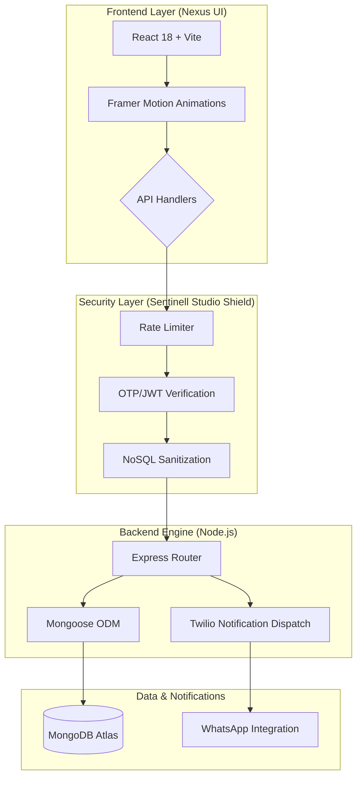

# 🛡️ Sentinell Studio | Elite Portfolio & Admin Platform

A high-performance, full-stack SaaS portfolio architecture featuring a secure Administrative Command Center, real-time lead notifications, and a high-density "Engineering Journal" UI.

## 🏛️ System Architecture



## 🌳 Project Architecture

```text
Sentinell-Portfolio/
├── client/                 # 🚀 React + Vite Frontend
│   ├── public/             # Static Assets (Custom Logo, Branding)
│   ├── src/
│   │   ├── components/     # High-Fidelity UI Components
│   │   ├── pages/          # Portfolio Hub & Admin Portal
│   │   ├── lib/            # UI Frameworks (Shadcn, Tailwind)
│   │   └── usePortfolioData.ts # Centralized State Management
│   └── package.json        # Frontend Stack
├── server/                 # 🛡️ Node.js + Express Backend
│   ├── index.js            # Hardened API Entry Point
│   ├── middleware/         # Security (JWT, OTP, Rate Limiting)
│   ├── models/             # Database Schemas (MongoDB/Mongoose)
│   ├── routes/             # Feature Routes (Auth, Messages)
│   └── package.json        # Backend Stack
├── .gitignore              # Global Security & Secret Locking
└── README.md               # Project Documentation
```

## 🛠️ Core Technology Stack
- **Frontend**: React 18, Vite, Framer Motion (Animations), Tailwind CSS.
- **Backend**: Node.js, Express, JWT (Authentication), Twilio (WhatsApp API).
- **Database**: MongoDB with Mongoose ODM.
- **Security**: Hardened with Helmet.js, Express-Rate-Limit, and NoSQL Injection Sanitation.

## 🛡️ Sentinell Studio Shield: Security First
This platform is built with a "Zero-Trust" administrative philosophy:
- **Physical OTP Entry**: Login is tied directly to the Admin's phone number via high-security OTP codes.
- **Total Endpoint Isolation**: Every administrative transaction is locked behind cryptographic JWT tokens.
- **Anti-Brute Force**: High-accuracy rate limiting blocks automated intrusion attempts.
- **Database Hardening**: Sanitized payloads protect against all common injection vectors.

## 🚀 Quick Start
1. **Initialize Environment**:
   - Create `.env` files in both `client/` and `server/` using your private credentials.
2. **Start Services**:
   - Run `python start.py` from the root directory to launch both the frontend and backend concurrently.

---
*Built for High-Impact Engineers.*
